# MPL_Clone
This project is made for educational purpose only.

[Medium Blog](https://medium.com/@sandeepbeherakbl/how-we-cloned-the-mpl-website-in-5-days-b447b0f81814)

## About Us
We are from Masai School, in the course of the third unit here, we learned HTML and CSS along with JS DOM, Constructor functions, Prototype and Inheritance, the usage of local storage and client Server Model, Asynchronous Programming, Promises, Fetch, Closure, Import/Export and ES6.

At the end of our 3rd unit, we were given a project as a part of our curriculum. We were divided into groups of six and each group was assigned a website to clone. My group had to clone [MPL](https://www.mpl.live/).

## About MPL
MPL is a gaming platform where you can win amazing rewards and cash by playing your favorite games. Here you can have a great gaming experience and fun , you can find a variety of tournaments and 1v1 battles around the clock. In our clone, we have tried to cover all the important functionalities and pages one would find over there. We use a technology stack containing HTML, CSS, and JavaScript.

## Tech stack
- HTML
- CSS
- JS

## About my teammates and their contributions : —

In our group their are total 6 people
Avinash Chengot, Bhanu Solanki, Dheeraj, Nilesh Agrawal, Prashant Ahire, and me Sandeep Behera

1. Sandeep & Bhanu are responsible for the landing page and the top nav bar.
2. Dheeraj was responsible for About, FAQ and Help page.
3. Prashant was responsible for the MPL Esports page.
4. Nilesh was responsible for the Blog page & Login page.

## A glimpse of the project: —

We tried to implement a workflow where the user could do the following things:

1. Landing Page

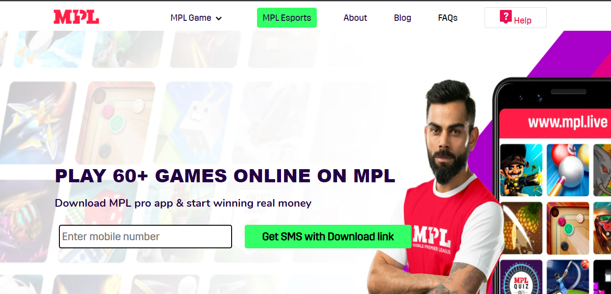

2. Mpl Games Drop Down

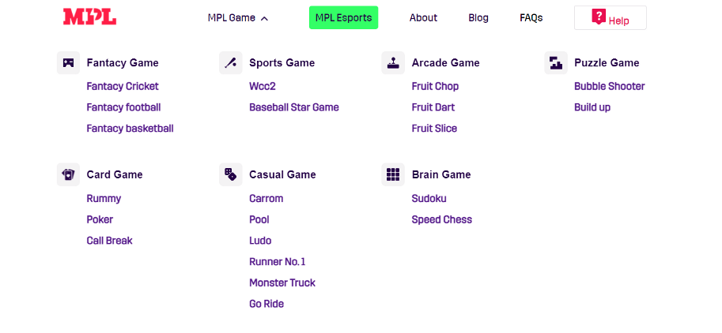

3. About

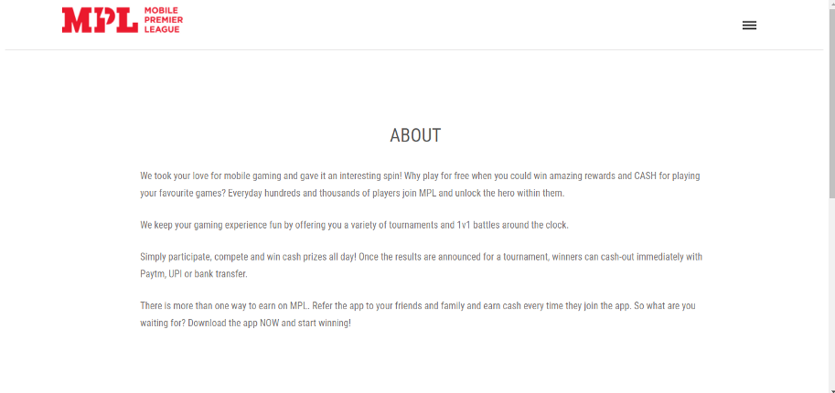

4. Blog

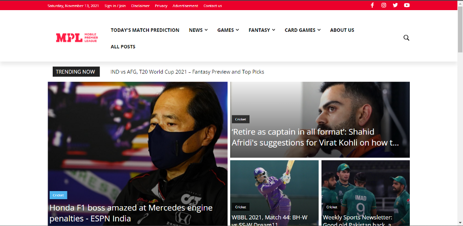

5. FAQ Page

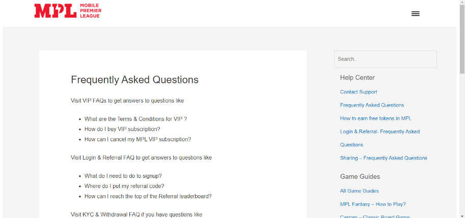

6. Help Page

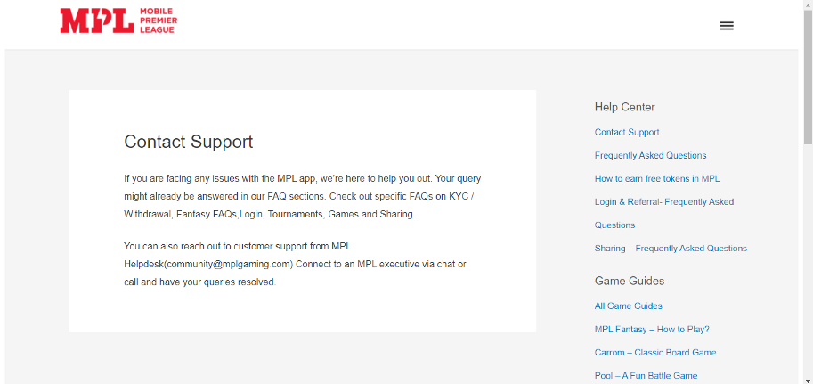

7. Sign In

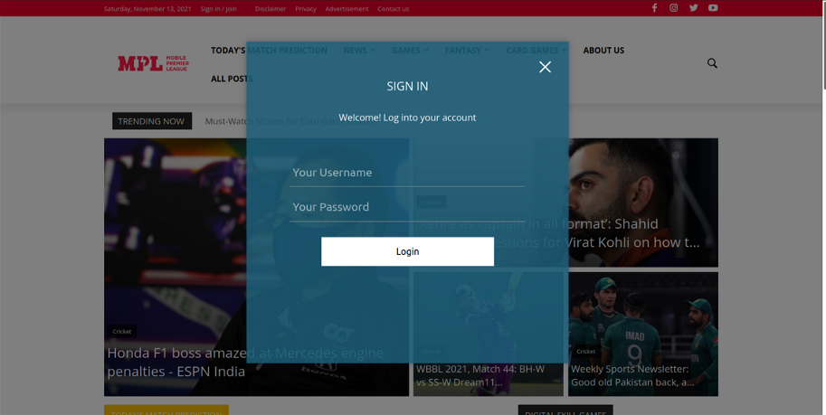

__Responsive Screens__

1.Home Page

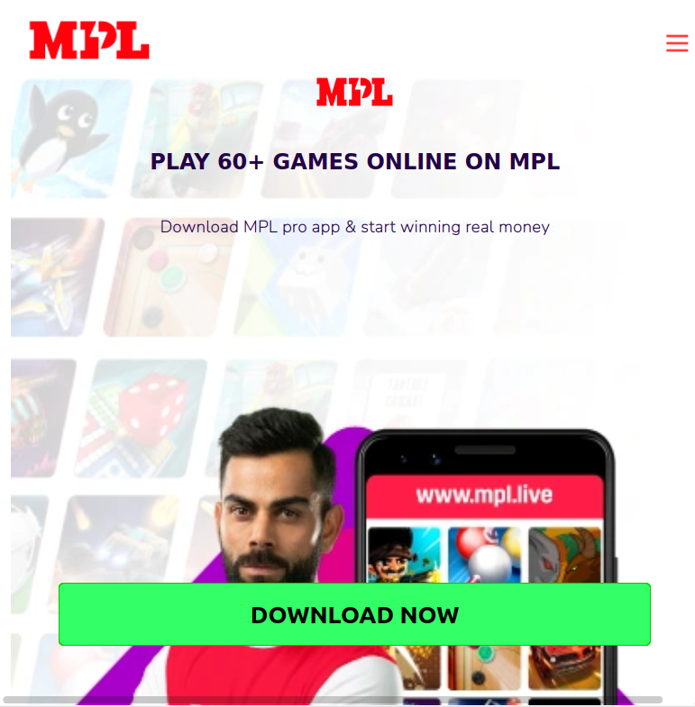

2.Home Page Navbar

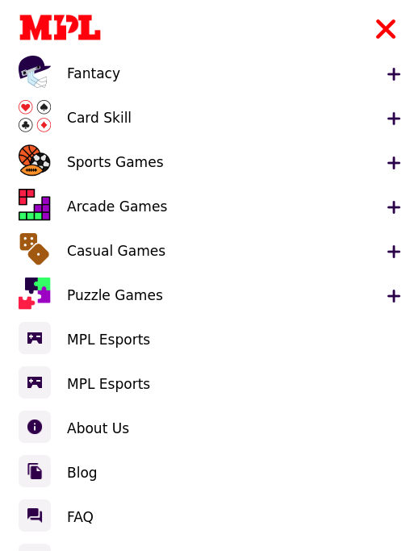

3.Blog Page

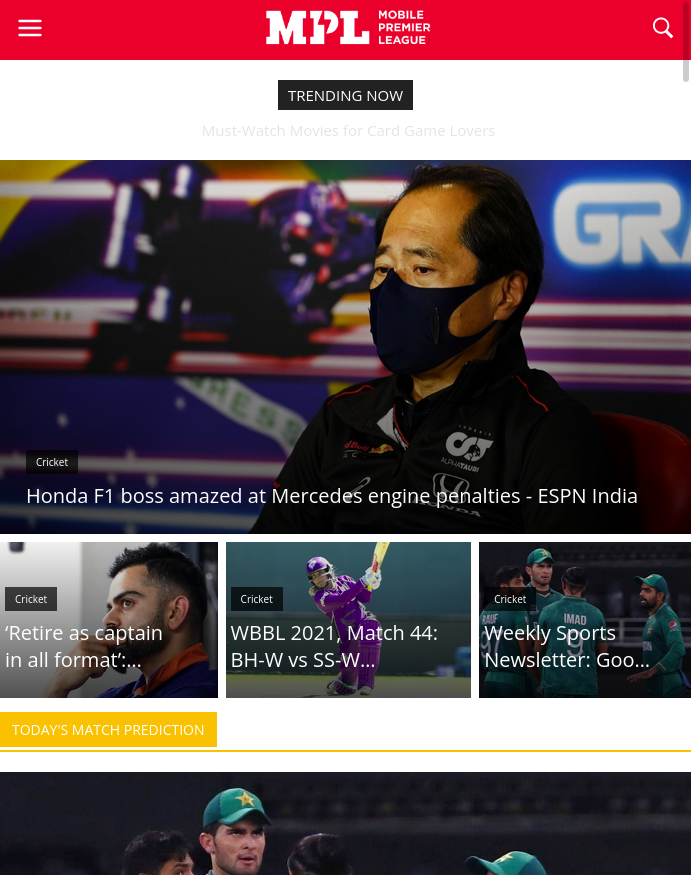

4.Blog Page Navbar

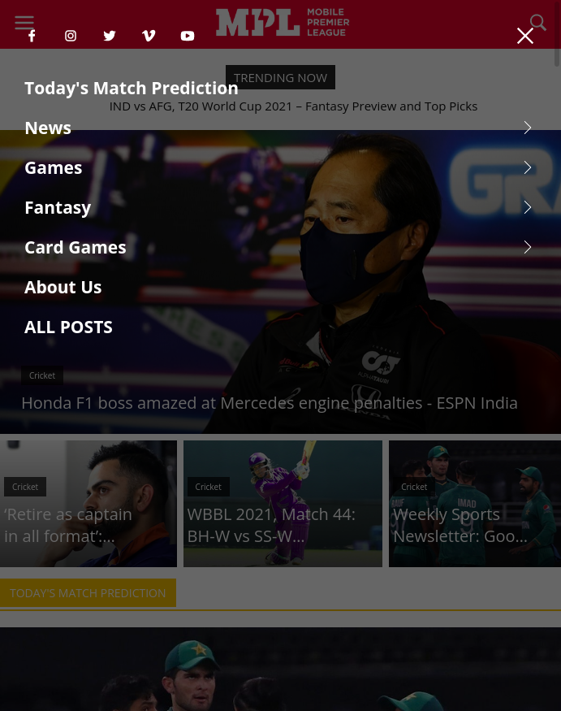

## Resources
- Api: [NewsAPI](https://newsapi.org/)
- Icons: [Icons8](https://icons8.com/)

